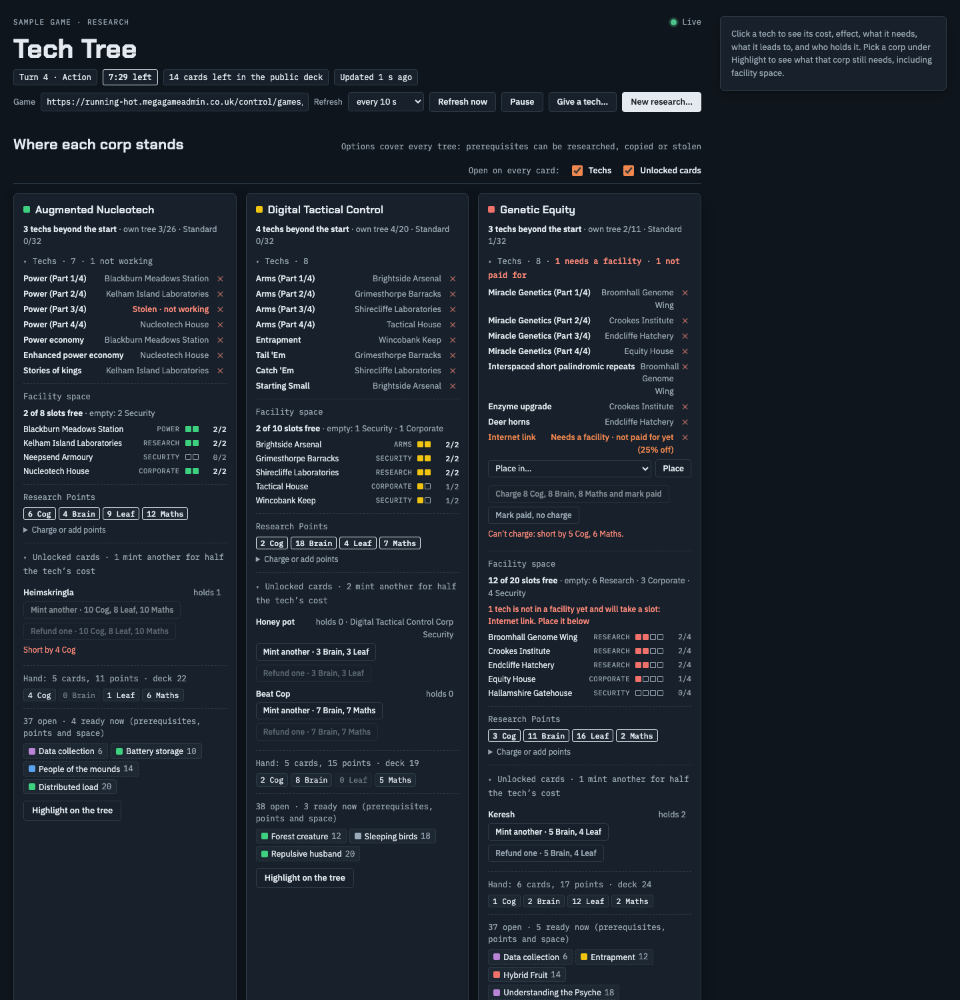
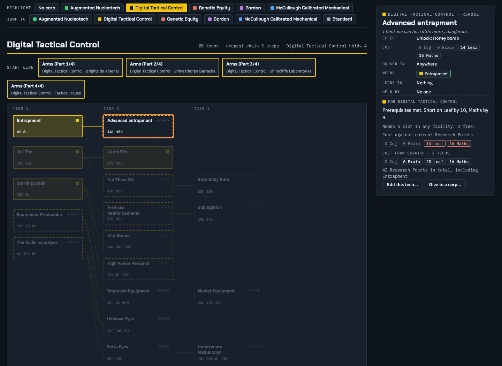
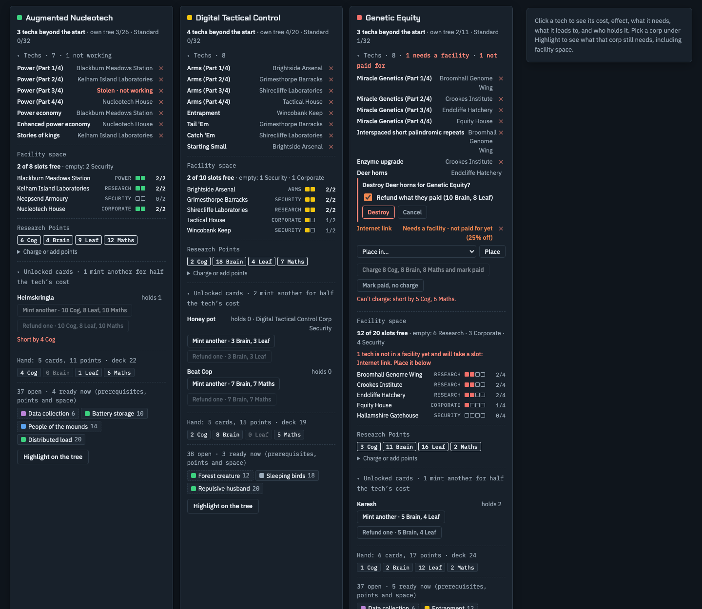
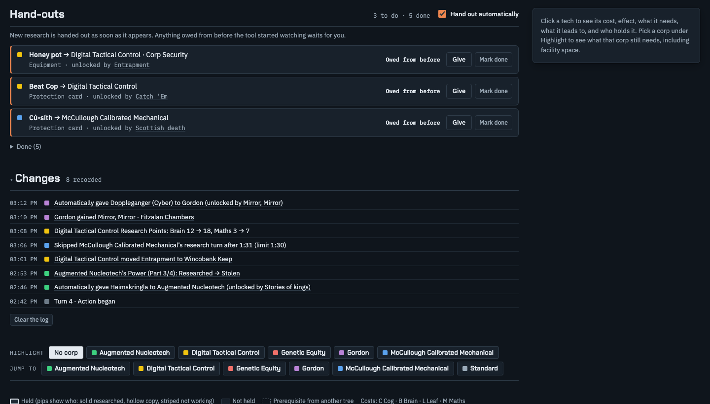
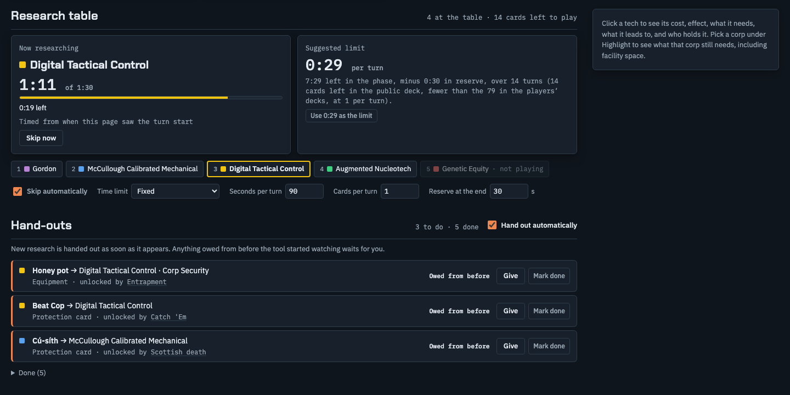
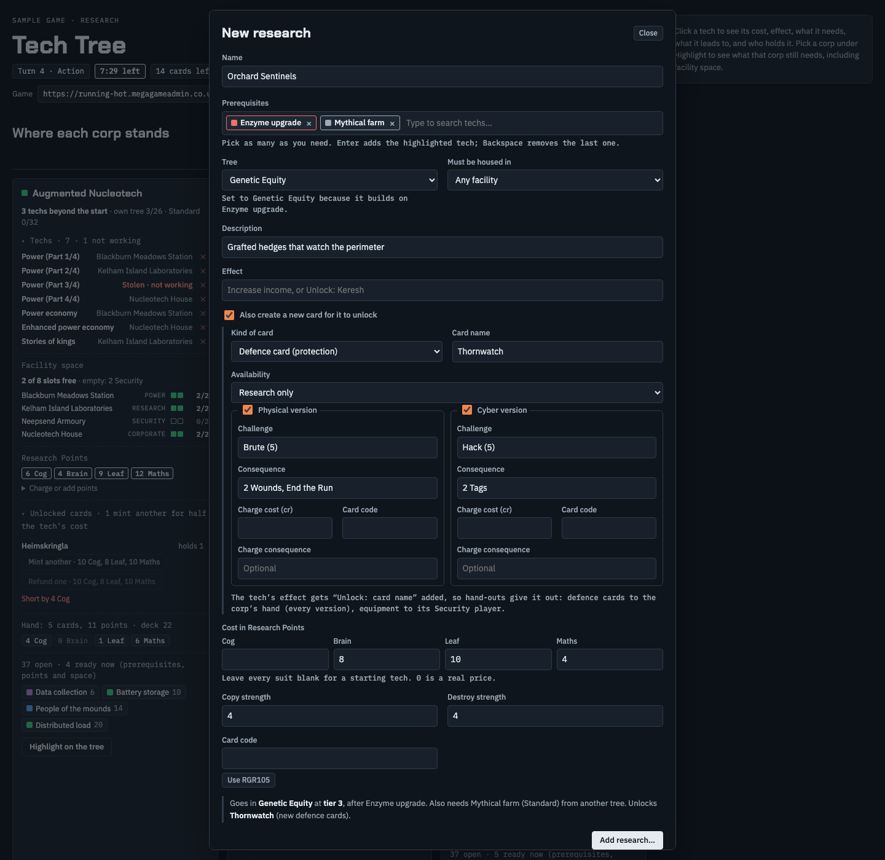
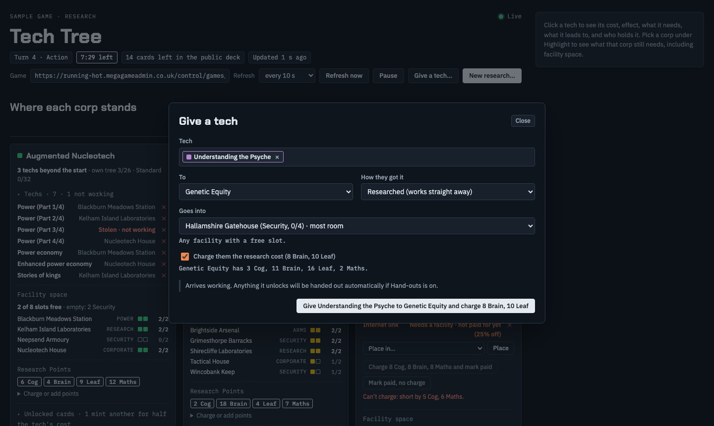

# Running Hot Tech Tree

A Chrome extension for running the research side of a **Running Hot** megagame from Control. It reads the game's Control pages with your existing sign-in, draws every research tree live, and gives you one place to run research during play:

- see where each corp stands
- hand out unlocked cards
- time the research table
- create techs and cards
- give, place, charge, refund and destroy



*Screenshots use a made-up sample game (see [Development](#development)).*

**Contents:** [Quick start](#quick-start) · [Research trees](#research-trees) · [Corp cards](#corp-cards) · [Hand-outs](#hand-outs) · [Research table](#research-table) · [Research builder](#research-builder) · [Giving a tech](#giving-a-tech) · [The rules it assumes](#the-rules-it-assumes) · [What it changes, and how safely](#what-it-changes-and-how-safely) · [How it works](#how-it-works) · [Development](#development) · [If something goes wrong](#if-something-goes-wrong)

## Quick start

**Install (once)**

1. Open `chrome://extensions` (in Edge it's `edge://extensions`; Brave and Arc work the same way).
2. Turn on **Developer mode** (top right).
3. Click **Load unpacked** and choose this folder.
4. Optional: pin the extension from the puzzle-piece menu so its icon stays on the toolbar.

Keep this folder where it is. Chrome loads the extension from it, so moving or deleting the folder breaks the extension. After pulling changes, click the reload arrow on the extension in `chrome://extensions`, then refresh the tree tab.

**Use**

1. Sign in to the game site in the same browser as usual (Continue with Discord), as Control.
2. Click the extension icon. The tree opens in a tab and refreshes on its own: every 10 seconds by default, or 5 s, 30 s or 1 minute. It checks every 2 seconds while a research sitting is open.
3. It follows game 2 by default. To follow a different game, paste its Control link (for example `https://running-hot.megagameadmin.co.uk/control/games/3`) into **Game** and press **Refresh now**.

The header shows the turn, the phase and time left in it, cards left in the public deck, and when the page last updated. The **Changes** log records research, copies, thefts, moves, Research Points, facility changes, techs added or edited in Control, skips, hand-outs and phase changes, with times. It's saved in the browser, so reopening the tab shows what changed while it was closed.

## Research trees



- Every tree (each corp's and Standard) is laid out in tiers after its prerequisites, with its starting techs above. Techs with no links sit below in **Standalone techs**.
- Dashed boxes are prerequisites that come from another tree. A red dashed **Not in the game** box is a prerequisite that matches no tech (a typo, or research that doesn't exist yet).
- Coloured pips on a tech show who holds it: solid for researched, hollow for a copy, striped for not working. A tech gained in the last 15 minutes gets a **New** tag; one just added in Control gets **Added**.
- **Highlight** a corp to see what it holds (filled), what it has the prerequisites for (dashed outline), and what's **Ready** now. **No space** marks a tech it could pay for but has no free slot of the right facility type for.
- **Click any tech** to trace its whole prerequisite chain. The side panel shows its cost, effect, where it must be housed, what it needs and leads to, who holds it, and the total cost to reach it from scratch. With a corp highlighted, the panel also shows what that corp still needs, including facility space. **Edit this tech…** and **Give to a corp…** are there too.
- A warning under a tree flags any prerequisite spelled differently from the real tech name, even by one capital letter. The site matches names exactly, so players can't research that tech until it's fixed (open it with **Edit this tech…** and save).

## Corp cards



Each corp card shows:

- **Techs**: every tech it holds and where it's housed, with copies, stolen and not-working cards marked. The small red **✕** at the end of a row destroys that tech (see below).
- **Facility space**: every facility with its type and used/total slots, how many are free, and a warning when a tech isn't in a facility yet.
- **Research Points**, with **Charge or add points**.
- **Unlocked cards**: the protection and equipment cards its working techs have unlocked, with how many it holds, **Mint another** and **Refund one**.
- **Hand**: its current research hand added up by suit, and cards left in its deck.
- **Options**: how many techs it has open in any tree, which are ready now, and which it could pay for but has no room for.

The **Techs** and **Unlocked cards** sections open and close per card (click the heading). A closed Techs section still shows its count and anything that needs you. The **Open on every card** switches in the section heading set the default. The cards don't redraw while you're typing in one.

**Placing a tech.** A tech not in a facility shows **Needs a facility** with a **Place in…** dropdown. It lists the same facilities the Research page's *Move to…* does: available, with a free slot, and of the tech's required type.

**Claimed copies.** A copy a corp got by trade or theft arrives **Claimed**. It takes a slot straight away, but doesn't work, count as a prerequisite or trigger hand-outs until its research player pays for it: the research cost minus the copy's discount (25% weak, 50% good or stolen, 0% shared). When that went wrong, settle it here:

- **Charge … and mark paid**: takes the discounted cost (rounded up) off their Research Points and turns it into a working copy.
- **Mark paid, no charge**: turns it into a working copy for free.

The site has no "mark as paid", so the tool swaps in a Researched copy. It adds the new copy first, then destroys the claimed one, then moves the new copy into the same facility, so the corp never loses the tech part-way.

**Charging or adding points.** Enter an amount in any suits and an optional reason (it goes in the game log), then **Charge** or **Add**. Charging is blocked if they can't afford it.

**Destroying a tech.** The red **✕** opens a confirm with **Refund what they paid** ticked. The refund gives back exactly what the site recorded them paying for that copy. Copies Control handed over for free show they paid nothing.

**Minting and refunding unlocked cards.**

- **Mint another** gives one more copy of an unlocked card: into the corp's hand for protection cards, or to its Security player (else CEO) for equipment. It costs half the unlocking tech's research cost, rounded up per suit.
- **Refund one** takes one back and refunds the same half price. It uses a copy in hand if there is one; otherwise it uninstalls the most recently installed copy, and the confirm names the facility.
- Cards with more than one version (a Physical and a Cyber Doppleganger, say) mint and refund one of **each** version for the one price.

## Hand-outs



When a corp gains a tech whose effect says **Unlock: …**, the Hand-outs list shows what it's owed, oldest first:

- **Protection cards**: one copy of each version into the corp's hand.
- **Equipment**: one copy to the corp's Security player, or its CEO.
- **Facility types** (Power, Arms, ID…): skipped. There's nothing to hand out for them on the site.

**Hand out automatically** is on by default. Research the tool sees happen is handed out within one refresh and logged. Anything already owed when the tool first opened a game shows **Owed from before**; click **Give**, or **Mark done** if you've dealt with it another way. Each new item shows when the tool first saw it.

**It never gives twice.** An item counts as done once the corp has been seen holding the card (in hand or installed), the tool has given it, or you've marked it done. That's remembered even after the card is used up and returned to Control, and each item is recorded before it's sent. After giving, the tool re-reads the site to confirm the card arrived. If the site refuses, the item shows **Failed** with **Retry**, and automatic hand-outs switch off until you turn them back on.

## Research table



While Control has a research sitting open (it opens when the Action phase starts), this shows:

- **The current turn:** who's researching, how long their turn has taken, and how long they have left.
- **Seats:** everyone in turn order.
- **A suggested limit per turn:** time left in the phase, minus a reserve, divided by the turns left. Turns left is the cards left to play divided by cards per turn. Cards left to play is whichever is smaller: the cards in the playing corps' research decks, or the cards left in the public deck. It never suggests less than 15 seconds, and says so when it has to round up to that.

Settings, remembered in the browser:

- **Skip automatically** (off by default) skips anyone who goes over the limit.
  - **It skips a named corp.** It takes them out of the sitting and sits them straight back down, which only moves the turn on if it's still theirs, and they keep their seat. So if they finish just before the deadline, the next researcher isn't skipped by mistake, as Control's **Pass the turn on** button can do.
  - **Checked first:** it re-reads the site right before skipping.
- **Time limit:** **Fixed** (seconds per turn) or **Follow the suggestion**.
- **Cards per turn** and **Reserve at the end** tune the suggestion.
- **Skip now** skips by hand.

The site shows whose turn it is but not when it started, so the tool times each turn from when it first sees it, to within about 2 seconds.

## Research builder



**New research…** in the header (or **Edit this tech…** in the side panel) replaces the site's tech form:

- **Prerequisites** are picked from the game's real techs as you type, showing each one's tree and code. Use ↑/↓ and Enter, and pick as many as you like; Backspace removes the last. Names are always spelled exactly and joined with semicolons. To name a tech that doesn't exist yet, pick **Use "…"** (it shows as a red dashed chip). Pasting a semicolon list turns it into chips.
- **Tree** follows the prerequisites. If they come from one corp's tree, the new tech goes in that tree, with a note saying why. If they come from two corps' trees, it asks you to pick.
- **Checks:**
  - A name or card code that's already taken blocks saving.
  - The preview shows the tier and tree the tech lands in, prerequisites from other trees, names not in the game yet, and a warning if leaving every cost blank makes it a starting tech.
  - Every **Unlock:** name in the effect is checked against the game's cards, equipment, techs and facility types.
  - **Use RGR105** fills in the next free card code.
- **Cost:** leave every suit blank for a starting tech. Once any suit has a price, blank suits count as 0.
- **Also create a new card for it to unlock:** make the card in the same form.
  - A **defence card** can have a Physical version, a Cyber version or both, each with its own challenge, consequence, charge and code.
  - An **equipment card** needs a type and an effect.
  - The card is created first, and the tech's effect gets "Unlock: card name", so hand-outs and minting pick it up.
- Nothing is sent until you confirm. Afterwards the tool re-reads the Cards page and reports anything that didn't save. **Editing** uses a route the site's own page doesn't offer, and changes every field.

Techs added on the Control **Cards** page appear on the next refresh too, in the tree you picked. The change log records techs added, renamed, moved or given new prerequisites.

## Giving a tech



**Give a tech…** in the header (or **Give to a corp…** in the side panel):

- **Pick:** search for the tech and pick the corp.
- **Where it goes:** into the facility with the most room that can take it (a free slot, of the right type). You can choose another facility, or none.
- **How they got it:** defaults to **Researched**, which works straight away. The copy options arrive **Claimed** and still need paying for.
- **Charge them the research cost** (Researched only): takes the full cost off their Research Points. It won't send if they can't afford it.
- **Checks:** it warns if they already hold the tech, and confirms the tech and the charge on the site afterwards.

## The rules it assumes

- **Ready now** means the corp holds every prerequisite, its Research Points cover the cost, and it has a free facility slot for the new tech.
- **Prerequisites:** any working copy counts, however the corp got it (researched, copied or stolen). So a corp can research into another corp's tree once it has the prerequisites.
- **Facility space:**
  - Every tech takes a slot, including unpaid claimed copies.
  - A tech with a *Housed in* type needs a slot of that type.
  - Each Corporate facility adds 2 slots to every facility the corp owns.
- **Affordability** uses Research Points only, not cards still in the hand.
- **Cards with several versions** under one name (Physical and Cyber) are owed, minted and refunded as every version.
- **Discounted prices** round up in each suit.

## What it changes, and how safely

The tool only changes the game when you click something, or through automatic hand-outs and auto-skip, which you can switch off. Every change:

- **uses the same request** the site's own Control buttons make
- **sends the site's security token** with it, which is why the extension needs the *cookies* permission
- **is re-read afterwards** to confirm it landed. If it didn't, you get a message saying what did and didn't happen.

Other safeguards:

- **Confirmation:** anything that costs or refunds points, destroys, creates or edits needs a confirm step.
- **Order of steps:** multi-step actions go in the order that can't lose anything. For example, settling a claimed copy adds the new copy before destroying the old one.
- **Where it connects:** the extension can only reach `*.megagameadmin.co.uk`. Nothing is sent anywhere else, and settings and the change log stay in your browser.

## How it works

The site is a Laravel/Inertia app: every Control page also serves its data as JSON. The tool reads three pages:

| Page | What it uses |
|---|---|
| `/control/games/{id}/research` | techs and prerequisites, corps' holdings, Research Points, hands, decks, facilities, the research sitting |
| `/control/games/{id}/facilities` | protection cards each corp holds (in hand and installed), facility types, installed cards |
| `/control/games/{id}/cards` | the protection card and equipment catalogues, who holds which equipment, the tree list |

Changes it can send, all to `/control/games/{id}/…`:

| Action | Request |
|---|---|
| Give a protection card / set copies in hand | `POST protection-card-holdings/give` / `PATCH protection-card-holdings` |
| Give equipment / set copies | `POST equipment-holdings/give` / `PATCH equipment-holdings` |
| Uninstall a protection card | `DELETE facilities/{facility}/cards/{card}` |
| Hand over, move or destroy a tech copy | `POST technology-holdings` / `PATCH` or `DELETE technology-holdings/{id}` |
| Create or edit a tech | `POST technologies` / `PATCH technologies/{id}` |
| Create a defence or equipment card | `POST protection-cards` / `POST equipment-cards` |
| Charge, add or refund Research Points | `POST trackers` (mode `adjust`) |
| Skip a researcher | `POST research/session/seats/{corp}` (take out, then sit back down) |

| File | What it does |
|---|---|
| `manifest.json`, `background.js` | the extension; the toolbar icon opens or focuses the tree tab |
| `tree.html`, `tree.css` | the page and its styles |
| `tree.js` | fetching and model, trees, corp cards, placing, settling, charging, destroying, change log |
| `handouts.js` | hand-outs, minting and refunding unlocked cards |
| `table.js` | the research table timer, suggestion and skipping |
| `composer.js` | the research builder |
| `give.js` | Give a tech |

## Development

**Test on the test game only.** Anything that changes data should be tried on game 3 (the Control Test Game), never on a live game. Clean up afterwards: delete test techs and cards, set points and card counts back, and close any sitting you opened.

**Demo and screenshots.** `docs/demo/demo.html` runs the real page against a made-up sample game (`sample-data.js`), with a stand-in for the site (`demo-stub.js`) so nothing reaches the real site. `demo-views.js` sets up each screenshot. To re-take them after changing the UI (needs Google Chrome and Node 22+):

```bash
node docs/demo/screenshots.mjs
```

You can also open `docs/demo/demo.html?view=builder` (or `tree`, `handouts`, `table`, `corp`, `give`) in Chrome to try the UI without signing in.

## If something goes wrong

- **"Signed out"**: sign in to the game site again in this browser. The tree picks it up on the next refresh.
- **"The extension doesn't have its cookies permission yet"**: reload the extension on `chrome://extensions`, then refresh the tab.
- **"Could not reach the game site"**: check your connection and the game link. The extension can only reach `megagameadmin.co.uk`.
- **A custom tech isn't researchable**: look for a spelling warning under its tree, then open it with **Edit this tech…** and save.
- **A traded tech doesn't work**: it's **Claimed** until its research player pays for it. Settle it from the corp card if that went wrong.
- **It stops understanding the page**: the site's data format has probably changed. The data mapping is in `tree.js` (`buildModel`) and `handouts.js` (`loadAux`).
